# 🔰Linux環境をAmazon Lightsailを利用して用意してみる

Linuxのお勉強用環境を用意するために、Hyper-VやWSL(Windows Subsystem for Linux)にUbuntuをインストールしてみたりしましたが。
最近、AWSのVPSサービスであるAmazon Lightsailは価格が半額になったよなと思い至り。

この価格ならLinux環境をLightsailで用意してもいいかもと思い立ったのでさわってみる。

## 🔰ドキュメント

- [AWS Lightsail](https://aws.amazon.com/jp/lightsail/)
- [Lightsail ドキュメント](https://lightsail.aws.amazon.com/ls/docs/ja/all)
- [なな転び八起のAWS 開発日記 第一話](https://aws.amazon.com/jp/campaigns/manga/vol1-1/) (第一話でLightsailが紹介されている)

## 🔰インスタンスの作成

Amazon Lightsailのコンソールにアクセスすると初回のためか言語を聞かれました。

とりえあずここでは日本語を選択して**Save**。

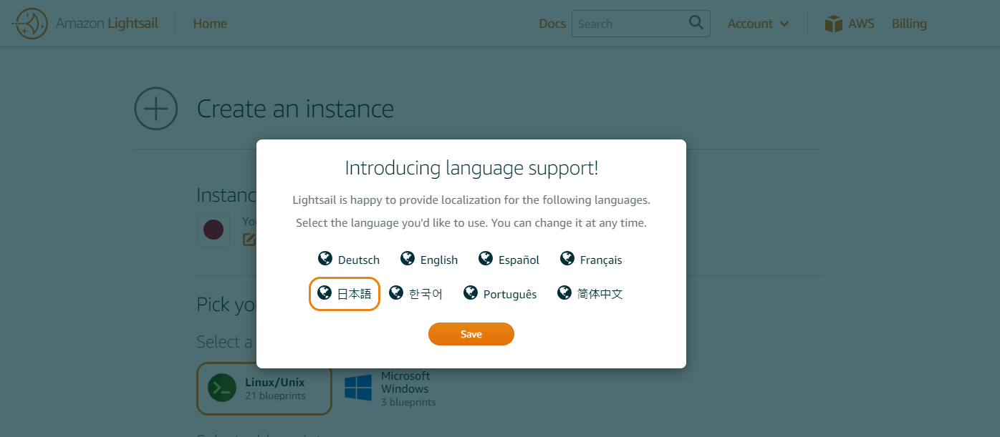

なんか可愛らしいロボットが出てきました。Amazon Lightsailのキャラクターでしょうか。

**では、始めましょう** を選択して進めていきます。


### インスタンスのロケーション選択

東京を選択

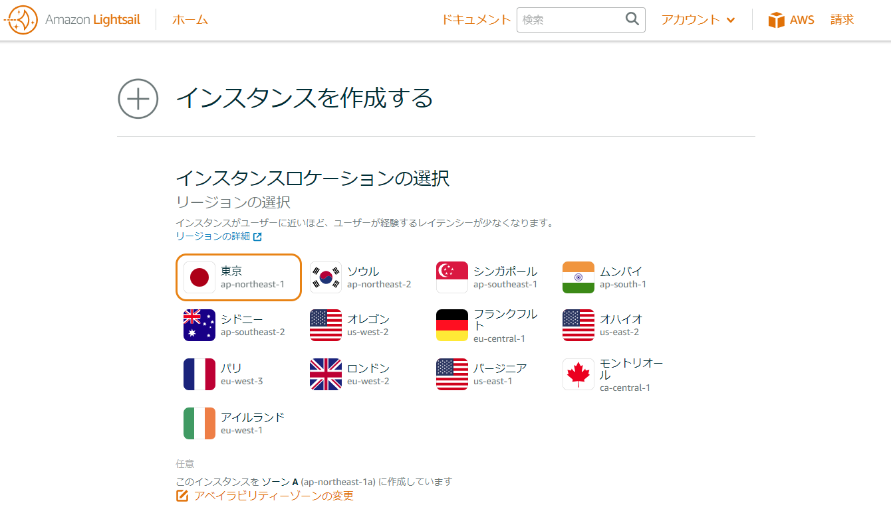

### インスタンスのOS選択

アプリ+OSとOSのみの選択肢があるようです。
今回はOSのみのUbuntu18.04 LTSを選択

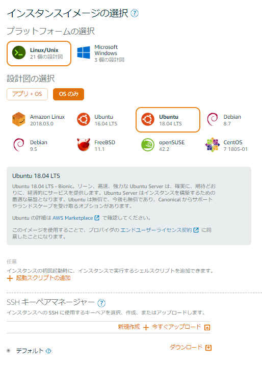

またSSHキーペアマネージャからSSH接続時に使用するキーペアの設定できるようです。
とりあえずデフォルトで良いので、ここでダウンロードしておきます。

LightsailDefaultPrivateKey-ap-northeast-1.pemファイルがダウンロードできました。

OpenSSHのssh-keygenコマンドを利用して鍵の種類とフィンガープリントを確認してみるとデフォルトは下記のようにRSAの2048bitな形式らしい。

ダウンロードしたキーをssh-keygenで確認  
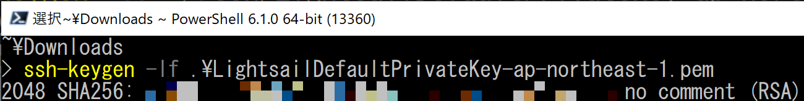

### インスタンスプランの選択

月額料金・メモリ・プロセッサー・ストレージ・転送の切り口で並べ替えボタンがついてます。
とりあえず最小構成の月額$3.50を選択。

- 512MB
- 1 vcpu
- 20 GB SSD

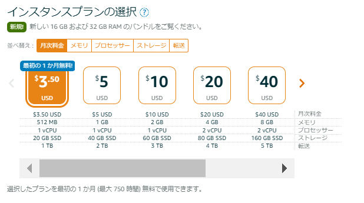

### インスタンスの名前の指定

Lightsailでは一意なインスタンス名を指定する必要があるようです。
とりあえずデフォルトのまま。

インスタンスの作成ボタンを選択。

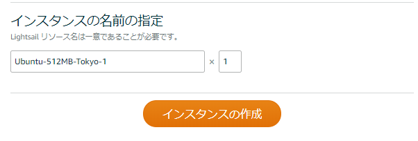

## 🔰ブラウザからインスタンスへ接続してみる

先ほど作成したインスタンスUbuntu-512MB-Tokyo-1のステータスが保留中になってるので少し待ちます。

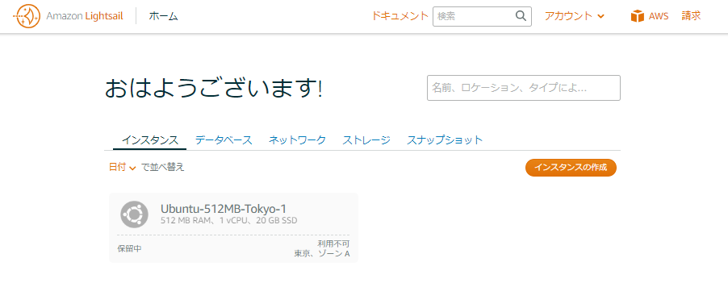

実行中に変わりインスタンスが起動しました。

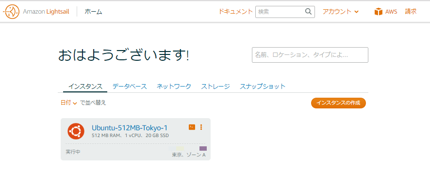

赤枠で囲ったコマンドシェルのアイコンをクリックしてみます。

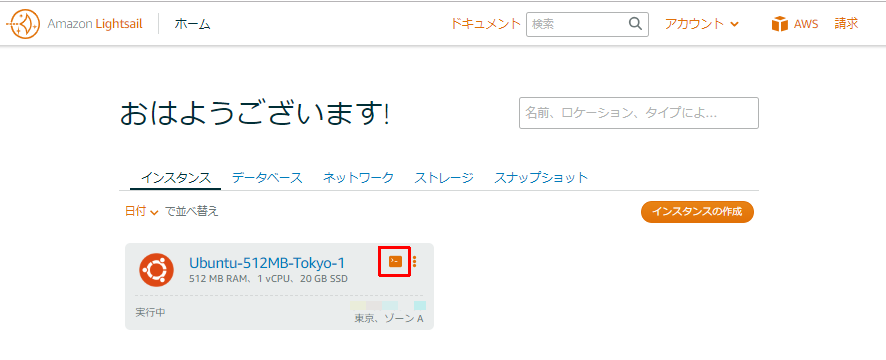

LightsailではブラウザベースのSSHターミナルが用意されているので、さっくりとブラウザが立ち上がってubuntuに繋がりました。

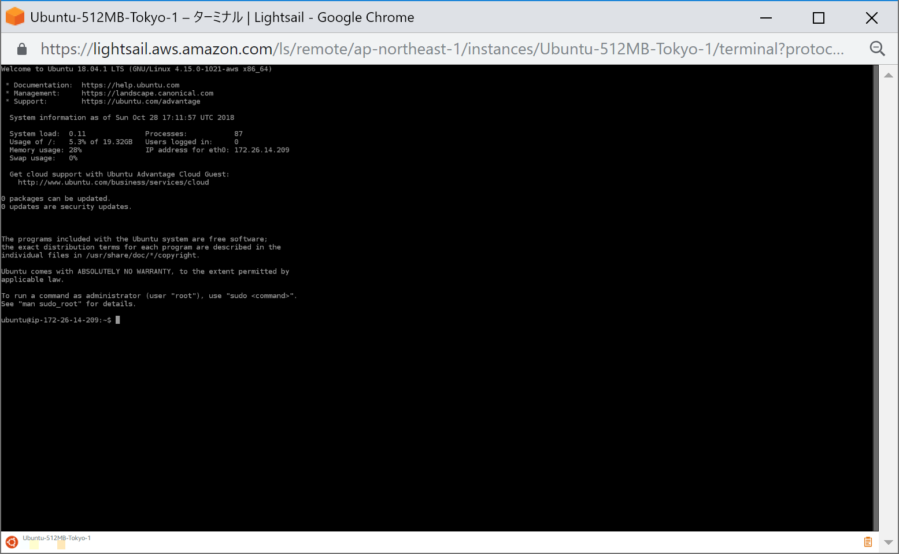

想像以上に手軽な感じでubuntu環境が立ち上がって接続できます。

### 🔰ホスト鍵のフィンガープリント確認

ブラウザから環境へ接続ができたので、とりあえずSSHクライアントで接続する時に備えてホスト鍵のフィンガープリントを確認しておきます。

`etc/ssh`を確認してみると、dsa/ecdsa/ed25519/rsaと各種ホスト鍵が格納してある事が確認できます。

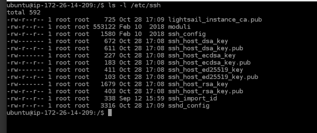

どれでもいいのですが今回はed25519のフィンガープリントを確認しておきます。

```bash
ssh-keygen -lf /etc/ssh/ssh_host_ed25519_key.pub
```

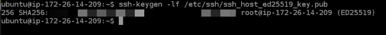

## 🔰SSHクライアント(OpenSSH)を利用してインスタンスへ接続してみる

インスタンス作成時の画面からダウンロードしたsshキーを利用してOpenSSHでログインしてみます。
なお今回はダウンロードしたキーをユーザディレクト配下の`.ssh`ディレクトリ(`~/.ssh`)に配置しました。

### 🔰Lightsailのデフォルトで利用されるプライベートキーについて

インスタンスの管理画面に、SSHクライアントを使用して接続する場合の説明が書いてあります。

ユーザ名はubuntuで、デフォルトのSSHキーはインスタンス作成時の画面の他にもアカウントページからダウンロードできるようです。

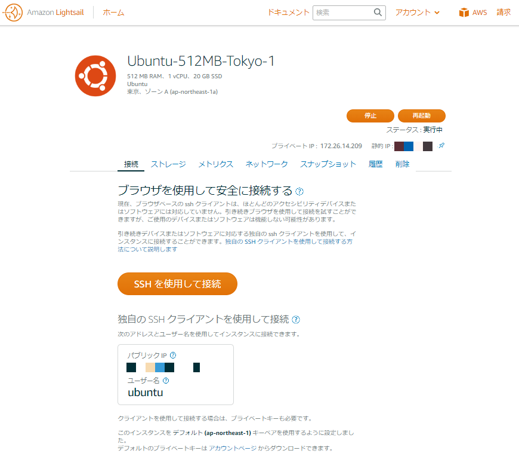

アカウントページのsshキータブを見ると、たしかにデフォルトのプライベートキーをダウンロードできるようです。

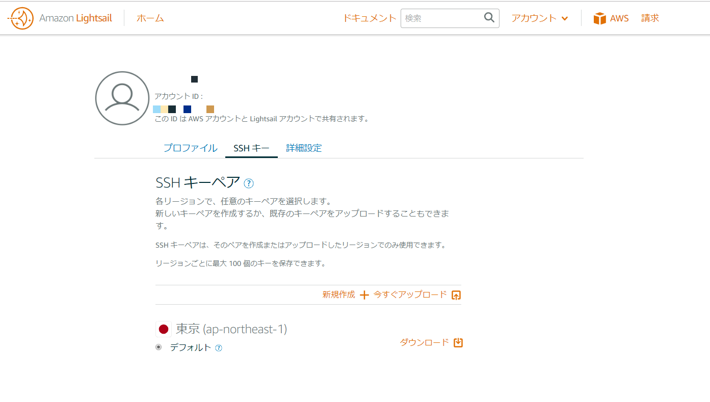

### 🔰PowerShell CoreからOpen-SSHを利用して接続

さきほどブラウザから接続した際にフィンガープリントを確認したホスト鍵はed25519形式なので`-oHostKeyAlgorithms`パラメータにssh-ed25519を指定してsshコマンドを実行。

```PowerShell
ssh -oHostKeyAlgorithms='ssh-ed25519' -i ~/.ssh/LightsailDefaultPrivateKey-ap-northeast-1.pem ubuntu@<host>
```

控えておいたのフィンガープリントと一致することを確認してyes

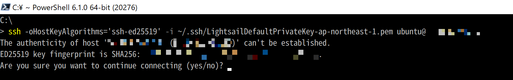

接続できました。

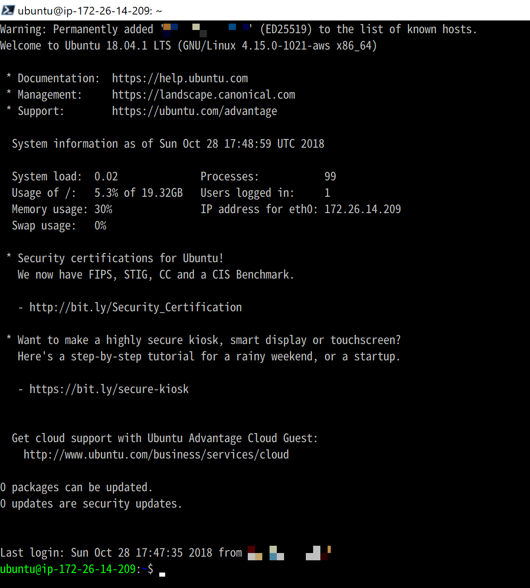

## 🔰Static IPを利用してみる

Lightsailではインスタンス停止時にパブリックなIPアドレスはリリースされるようです。
パブリックIPを固定したい場合は、Static IPの機能を利用する。

Ligthsailのホーム画面からネットワーク→静的IPの作成を選択。


### 🔰静的IPアドレスの作成

#### 静的IPロケーションの選択

東京を選択

#### インスタンスへのアタッチ

インスタンスへのアタッチは先ほど作成したUbuntu-512MB-Tokyo-1を選択

#### 静的IPの名前付け

とりえあずデフォルト(StaticIp-Tokyo-1)


作成を選択

### 🔰StaticIp-Tokyo-1

さっくりStaticIPアドレスが発行されました。

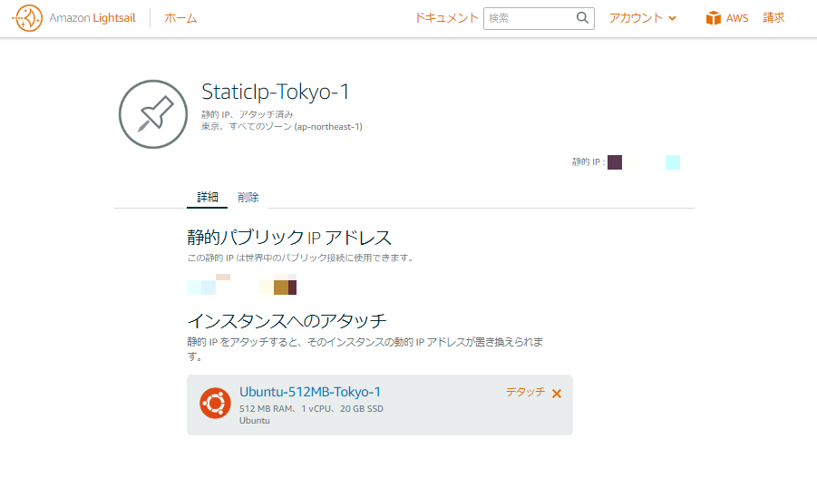

アタッチしたインスタンスを確認してみると、確かに先ほど発行されたIPアドレスが設定されています。

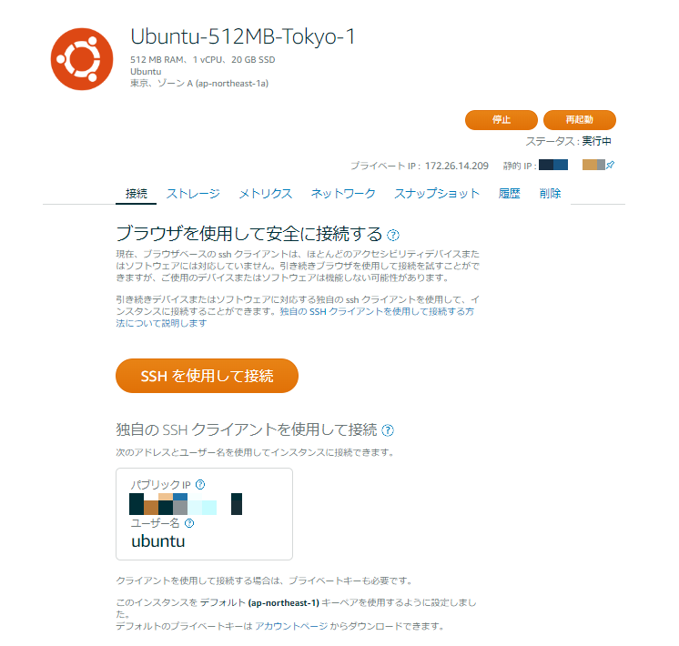

### 🔰Static IPの価格について

Lightsailでは静的IPの価格は下記のようになっている。

[Lightsail 静的 IP にかかるコストはどれくらいですか?](https://aws.amazon.com/jp/lightsail/faq/)

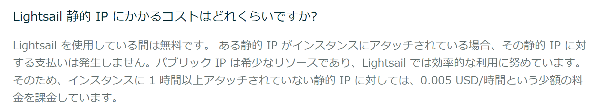

Lightsailは月額なので動かしっぱなしが基本？　な気もするので、動かしっぱなしならばとりあえずStatic IPつけといて価格的なデメリットはない。が、インスタンス削除等した場合にはStaticIPを忘れずに削除しないと課金が発生するため要注意。

## 🔰総評

思った以上に手軽に利用できて、ちょっとLinuxさわる環境が欲しい場合なんかはぴったりな気がします。

月額3.5ドルはかなり手が出しやすい価格。

あとマスコットキャラクター？　のロボットが結構かわいい。
名前あるのかな？　この子。
